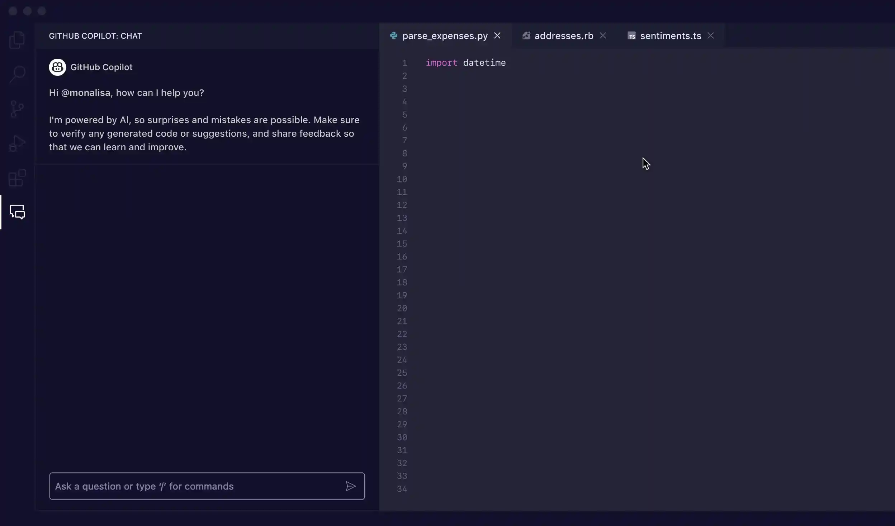

# Inteligencia Artificial en el Campo de la Informática: Desarrollo

**Alumno:** Raúl Juárez  
**Profesor:** Meritxell  
**Módulo:** MDS

## Índice
1. [Introducción](#introducción)
2. [Aplicaciones de la IA](#aplicaciones-de-la-ia)
3. [Impacto al sector](#impacto-al-sector)
4. [Impacto ambiental](#impacto-ambiental)
5. [Propuestas para minimizar los impactos ambientales](#propuestas-para-minimizar-los-impactos-ambientales)
6. [Conclusión](#conclusión)

## Introducción
La inteligencia artificial (IA) en el ámbito del desarrollo de software está transformando la forma en que se diseñan, crean y mantienen las aplicaciones informáticas. A través de herramientas avanzadas y algoritmos inteligentes, la IA está optimizando procesos, reduciendo tiempos de desarrollo y mejorando la calidad del software.

## Aplicaciones de la IA

  

  Un ejemplo destacado de IA aplicada al desarrollo de software es **GitHub Copilot**, que te ayuda a escribir código más rápido y con menos esfuerzo. 

  Da soporte a los desarrolladores en diferentes tareas clave como:

  - **Autocompletado Inteligente:** Sugiere líneas de código y estructuras completas basadas en el contexto del archivo actual.
  - **Generación de Funciones:** A partir de descripciones en lenguaje natural, Copilot puede crear funciones que cumplan con los requisitos planteados.
  - **Detección de Errores Comunes:** Identifica posibles problemas en el código mientras se escribe, mejorando la calidad desde el inicio.
  - **Optimización de Código Existente:** Propone refactorizaciones para hacer el código más limpio, eficiente y legible.
  - **Compatibilidad Multilenguaje:** Admite una amplia gama de lenguajes de programación, lo que lo convierte en una herramienta versátil para equipos diversos.

  Estas funcionalidades no solo aceleran el desarrollo, sino que también permiten a los programadores enfocarse en tareas más creativas y de mayor valor.

  Para más información sobre GitHub Copilot pulsa [aquí](https://docs.github.com/en/copilot/about-github-copilot/what-is-github-copilot).

## Impacto al Sector
El impacto de la IA en el desarrollo de software es notable por los siguientes motivos:

- **Eficiencia Mejorada:** Reducción del tiempo necesario para tareas como el debugging y la documentación.
- **Accesibilidad:** Facilita la entrada a la programación para principiantes mediante asistentes que guían el proceso de desarrollo.
- **Innovación:** Permite crear aplicaciones más complejas y funcionales en menos tiempo, expandiendo las posibilidades de lo que se puede lograr.

A pesar de estos beneficios, también se plantean desafíos como la dependencia de herramientas externas y la necesidad de garantizar la seguridad en los sistemas generados con IA.

## Impacto Ambiental
El uso de IA en el desarrollo también tiene implicaciones ambientales:

- **Consumo Energético:** Las herramientas de IA para desarrollo requieren potentes infraestructuras para su entrenamiento y ejecución.
- **Huella de Carbono:** Los servidores que alojan estos sistemas contribuyen a las emisiones globales.

## Propuestas para Minimizar los Impactos Ambientales
Para mitigar los efectos negativos en el medio ambiente, se pueden adoptar las siguientes medidas:

1. **Desarrollo de Herramientas Eficientes:** Crear algoritmos optimizados para requerir menos recursos computacionales.
2. **Uso de Infraestructura Verde:** Ejecutar herramientas de desarrollo en servidores alimentados por energías renovables.
3. **Formación en Prácticas Sostenibles:** Capacitar a los desarrolladores para escribir código que maximice la eficiencia y reduzca la redundancia.
4. **Colaboración Internacional:** Compartir avances tecnológicos para evitar duplicación innecesaria de esfuerzos y recursos.

## Conclusión
La IA está cambiando radicalmente el desarrollo de software, proporcionando herramientas que incrementan la productividad y la calidad del producto final. Sin embargo, este progreso debe ser equilibrado con estrategias sostenibles que reduzcan su impacto ambiental, asegurando un desarrollo tecnológico responsable.

 
 

#### ***Referencias: *** 
- *https://docs.github.com/en/copilot/quickstart*
- *https://www.youtube.com/watch?v=jsHAyBmFZlo*
